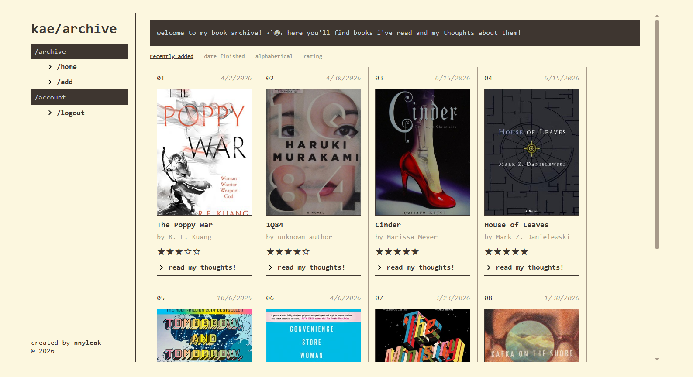
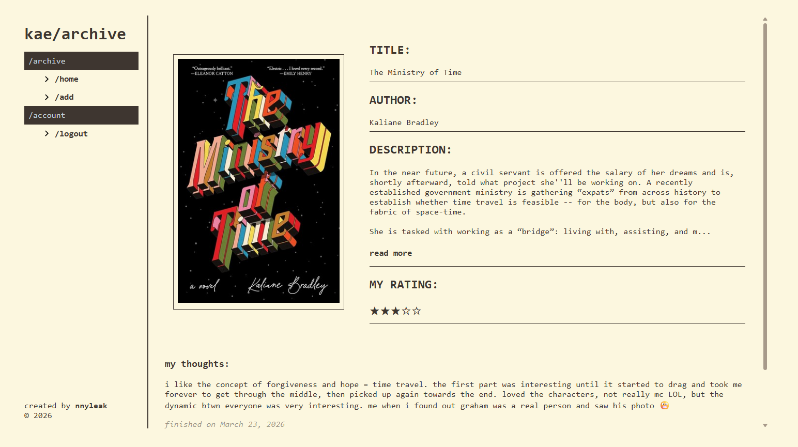
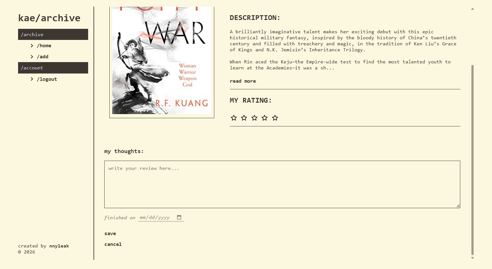

# kae/archive

a personal book archiving site for the books i've read, made with react, express, and postgresql! deployed on vercel, backend on render.

live demo → [kae/archive](https://kae-archive.vercel.app/)

## ⭑ features

- browse the book archive with cover art, ratings, and quick-view cards
- sort by recently added, date finished, alphabetical, or rating
- view full book details: includes book cover, author, description, my rating, date finished, and review
- admin actions:
- search any book by isbn, pulling data from the Open Library API
- add, edit, and delete entries
- protected by jwt authentication

## ⭑ tech stack

- react
- vite
- node.js + express
- postgresql/supabase
- jwt authentication
- axios
- custom css
- [open library](https://openlibrary.org/developers/api) — book metadata by isbn

## ⭑ screenshots





## ⭑ usage

> [!NOTE]
> you will need to have PostgreSQL and pgAdmin 4

1. clone this repo

    ```bash
    git clone https://github.com/nnyleak/book-notes.git
    cd book-notes
    ```

2. set up environment variables

    create a `.env` file inside the `server/` directory:

    ```env
    DATABASE_URL=your_postgresql_connection_string
    SECRET=your_jwt_secret
    ```

3. run the sql schema in [schema.sql](schema.sql) to initialize the database

4. install dependencies

    ```bash
    # server
    cd server
    npm install

    # client
    cd client
    npm install
    ```

5. create local admin account

    ```bash
    cd book-notes
    npm run seed-admin
    ```

5. run locally

    ```bash
    cd book-notes
    npm run dev
    ```

    open [http://localhost:5173](http://localhost:5173) in your browser!
    > admin account\
    > username: admin\
    > password: admin123

## ⭑ notes

- book data is fetched from the open library, i've experienced that it can be unreliable and not all isbns will return results. response times may vary greatly
- the app is read-only for guests
- adding, editing, and deleting entries requires logging in

## ⭑ future improvements

- swap to Google Books API, use Open Library as fallback
- responsive/mobile layout
- caching for external api responses
- more search/filtering options (search by title, author, genre, etc)
- user accounts
- custom collections
